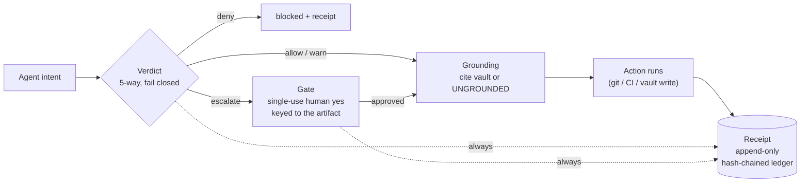

# The Dojo Harness — governed seams for agent actions

## Context

The dojo trains agents with **discipline**, but it does not yet **harness** them.

Today, enforcement is two things:

1. **Guidance** — skills (`privacy`, `secret-scanning`, `pii-detection`, `risk`,
   `verify-before-done`) that *ask* the agent to behave.
2. **A post-hoc gate** — `scripts/verify.sh`, run in CI or pre-PR, that checks the
   result *after* the work is done.

Both are real, and both leave the same hole: **nothing intercepts the agent at the
moment its intent becomes a real action.** A skill is an instruction the agent can
reason its way around; `verify.sh` fires after the branch already exists. Between
"the agent decided" and "the world changed" there is no seam for a decision to live
in — the *naked line*. An agent that force-pushes over a colleague's work, deletes a
worktree with uncommitted changes, or pastes a secret into a commit has already done
it before any gate runs.

A harness closes that gap by putting a decision **at the seam** — every place where an
agent's intent turns into an irreversible, real-world action.

### What the dojo can actually enforce

Honesty first, because it bounds the whole design. A Markdown/shell/TS framework can
only *structurally* enforce the seams it **owns as a process**:

| Seam | Owned? | Mechanism available |
|---|---|---|
| Git operations (commit, push, branch delete, worktree remove) | ✅ owned | git hooks |
| CI / pre-PR | ✅ owned | `verify.sh` + GitHub Actions |
| MCP memory writes (the vault) | ✅ owned | the MCP server (`memory/`) |
| Filesystem / shell inside a user's IDE | ❌ advisory only | skills (guidance) |
| Model calls inside the agent runtime | ❌ advisory only | skills (guidance) |

The harness must be **loud about this line**. It hardens the owned seams for real and
keeps everything else as explicit advisory discipline — it must never *claim* a
universal runtime wrapper it cannot deliver.

## Decision

Introduce a **Harness layer** — a fourth architectural layer beneath skills, agents,
and fleet — that attaches **four things** at every dojo-owned seam, with a
**fail-closed** default (`deny` when anything is uncertain, errors, or is unowned but
dangerous).

The four attachments (the same anatomy the discipline skills gesture at, now made
structural):

1. **Verdict** — a five-way decision at the seam: `allow · warn · deny · escalate ·
   redact`, not a boolean. An error in the check resolves to `deny`, never `allow`.
2. **Grounding** — a decision or claim cites a source in the memory vault, or is
   stamped `UNGROUNDED`. An ungrounded destructive action does not proceed.
3. **Receipt** — every verdict is written to an **append-only, hash-chained** ledger
   that a `verify()` walk can prove was not tampered with. The receipt is mandatory;
   its delivery is best-effort (logging trouble must never halt the agent).
4. **Gate** — irreversible actions require a **single-use** human approval keyed to the
   exact artifact (the diff / the command), not a standing "this agent may push".

**Read it as:** a skill is a *what*, an agent is a *who*, the fleet is a *team* — and
the **harness is the seam** that stands between any of them and an irreversible act.

### Where it lives

- **Verdict + Gate** — git hooks (`pre-commit`, `pre-push`) plus a small guard command
  in `control-plane` that the hooks and CI call. The guard owns the five-way policy.
- **Grounding** — enforced in the finishing/verify skills and the MCP memory-write
  path: a vault write or a "done" claim must carry a citation or an explicit
  `UNGROUNDED` stamp.
- **Receipt** — a hash-chained ledger under `memory/` (upgrading the curator's existing
  per-run audit trail), with a `verify()` walk wired into `verify.sh`.
- **Gate** — a durable, single-use approval queue keyed to the artifact fingerprint;
  the `escalate` verdict is what routes into it.

### Phasing (kata order — each wave shippable alone)

| Wave | Item | Owned seam |
|---|---|---|
| **H1** | Hash-chained **Receipt** ledger + `verify()` in `verify.sh` | audit |
| **H2** | **Verdict** guard (five-way, fail-closed) behind git `pre-push`/`pre-commit` | git ops |
| **H3** | **Gate** — single-use, artifact-keyed approval routed from `escalate` | irreversible git ops |
| **H4** | **Grounding** — cite-or-`UNGROUNDED` on vault writes + "done" claims | MCP memory |
| **H5** | Advisory harness skill documenting the un-owned seams honestly | guidance |

## Alternatives Considered

- **Keep guidance-only (status quo)** — rejected: instructions and a post-hoc gate
  cannot stop an irreversible action *before* it happens; the naked line stays open.
- **Claim a universal runtime wrapper over every agent action** — rejected: the dojo
  does not own the agent's process inside a user's IDE or model runtime. Promising
  enforcement there would be dishonest and unenforceable.
- **Adopt an external policy engine (e.g. OPA/Rego) up front** — deferred: heavier
  than the dojo's Markdown/shell/TS surface warrants for H1–H4. Revisit if the guard's
  policy outgrows a small hand-written ruleset.
- **Rely on branch protection / CODEOWNERS alone** — rejected as *sufficient*: those
  gate the PR, not the local irreversible act (force-push, worktree wipe, secret in a
  commit), and they leave no tamper-evident receipt.

## Consequences

- **Positive:**
  - Irreversible, dojo-owned actions become **decidable, attributable, and
    reversible-or-blocked by construction** — not by the agent's good behaviour.
  - The discipline skills stop being purely advisory for the seams the harness owns.
  - A tamper-evident receipt makes every session auditable; `verify.sh` gains teeth.
  - The dojo starts *practising* the harness thesis it teaches, on itself.
- **Negative:**
  - New friction: git hooks and a guard step on every push; contributors must install
    the hooks (or the guard degrades to advisory, which must be signalled loudly).
  - The harness is never "done" — every new dangerous action is a new seam to wrap.
- **Risks:**
  - **Enforcement theatre** — if the guard is trivially bypassable (`--no-verify`),
    the receipt must at least record the bypass so it is visible, never silent.
  - **Scope creep** into the un-owned seams; the owned/advisory line must stay explicit.
  - Local hooks are opt-in; CI (`verify.sh`) must be the backstop that re-checks the
    receipt so a skipped local hook cannot pass unnoticed.

## Backlinks

<!-- Auto-generated by scripts/link-index.sh -->
_No backlinks yet._
